# Ulric Booking Desk


Direct booking and invoicing for Eric's five stays in Eugene, OR, near Hayward Field. Guests request dates on a public page. The host approves the request, collects a signed agreement, tracks the invoice, and keeps reminders in an outbox. Each listing links to its Airbnb page. Nightly prices are shown as from rates. Demo guests are first names only.

Payment links use the demo handle `ulric-demo`. This desk never charges a card. Nothing is emailed or texted.

## Features

- A public catalog of the five stays, each with Eric's listing photos, description, amenities, house rules, a month calendar, and a request form. Open, held, and booked days are marked. Dates held by a linked stay are hatched and labeled with that unit.
- Host desk with open requests, upcoming bookings, a monthly revenue chart, and settings for each listing: rate, deposit percent, fees, house rules, and cancellation policy.
- A contract PDF for each approved booking. The guest signs with a typed script or a drawn signature. The file stores the signature image, the time, and the IP address. The host signature is set in advance. Both sides can download the PDF.
- An invoice per approved booking with line items, deposit, balance, and due dates. PayPal and Venmo links use `ulric-demo`, and each link has a QR code. The host can mark a payment with method, amount, date, and reference. Status chips show unpaid, partial, paid, and overdue.
- A reminder schedule for the deposit, the balance, check-in instructions, and a review request. Email is always scheduled. SMS is scheduled when the guest left a phone number. A background service logs due reminders to the Outbox.
- Light and dark themes. The first visit follows the system preference. The header toggle stores the choice in `localStorage`.
- Motion for routes, counts, the revenue chart, the request diagram, and the house model. Details are in the Motion section. `prefers-reduced-motion` keeps those changes instant.

Sample agreements and invoices are in `docs/samples/`.

## Stack

- ASP.NET Core 8 Web API
- Angular standalone components and signals
- Entity Framework Core migrations
- SQLite by default, so `dotnet run` needs no database server
- Pomelo MySQL provider when `Database:Provider` is `MySql` (MySQL 5.7 and 8, utf8mb4)
- QuestPDF community license for agreements and invoices
- Chart.js for the revenue chart
- three.js r170 for the nested-stay model, loaded only when that section is on screen

## Motion

Pages fade and rise 12px in 340ms with the curve `cubic-bezier(.2, .7, .2, 1)`. Lists stagger their children. Buttons and the theme control ease color. Switching theme eases the paper and ink. Dashboard figures count up when they enter the view. Monthly bars grow from zero. An invoice draws a thin paid line from empty to the share that has been paid.

The catalog page includes an SVG of the path from request to paid. The line draws in when the section is visible.

The same page has a 3D stack of the Eugene house, driven by the same contains graph the API uses. The 4-bed is the outer volume and contains the 3-bed, the 2-bed, and the studio. The 3-bed contains the 2-bed. The garden cottage sits beside the house and links to nothing. Pick a stay and the rooms that booking blocks light up:

- A 4-bed booking blocks the 3-bed, the 2-bed, and the studio.
- A 3-bed booking blocks the 2-bed and the 4-bed. The studio stays open.
- A 2-bed booking blocks the 3-bed and the 4-bed. The studio stays open.
- A studio booking blocks the 4-bed. The 3-bed and the 2-bed stay open.
- A cottage booking blocks only the cottage.

Drag to turn the stack. The render pauses when it leaves the screen and caps the pixel ratio at 2. With reduced motion, or if WebGL is missing, the flat plan stays in its place and does not orbit.

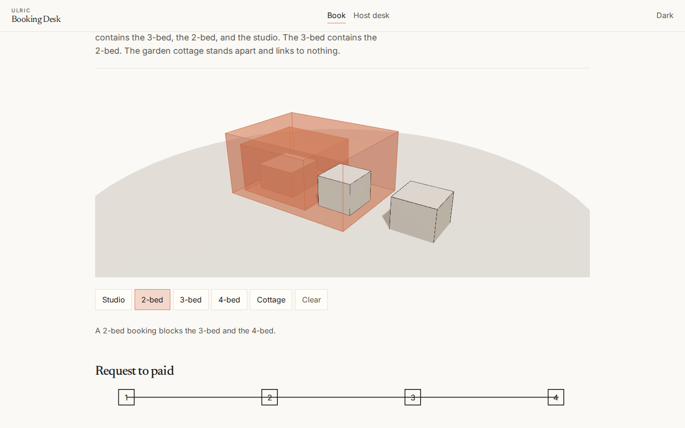

`video/` is a Remotion reel of about 25 seconds. It is not part of CI. From that folder:

```bash
npm install
npm run render
```

The file lands at `video/out/desk-reel.mp4`.

## Screenshot tour

Light desktop is the default. The same screens exist in dark mode and at phone width (390 by 844). Files live in `docs/screenshots/` as `{screen}-{light|dark}-{desktop|phone}.png`.

| Screen | Light | Dark |
| --- | --- | --- |
| Catalog |  | 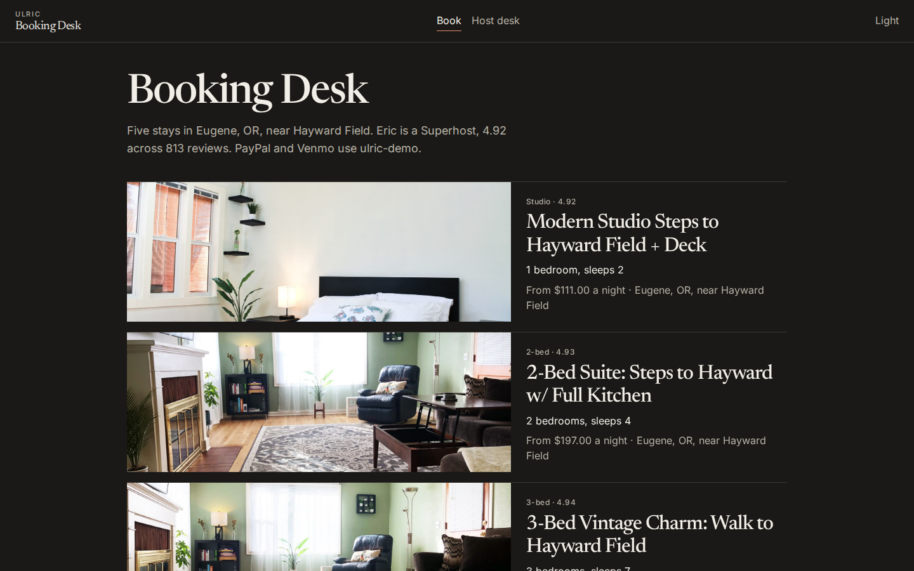 |
| Studio | 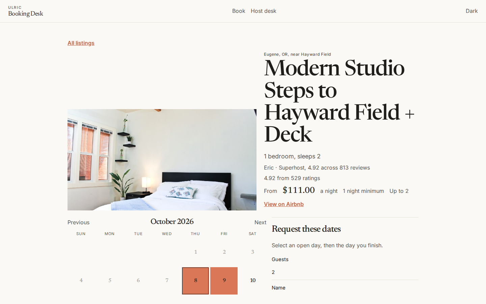 | 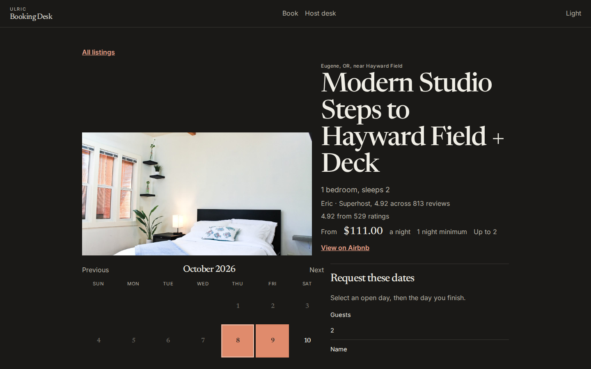 |
| 2-bed | 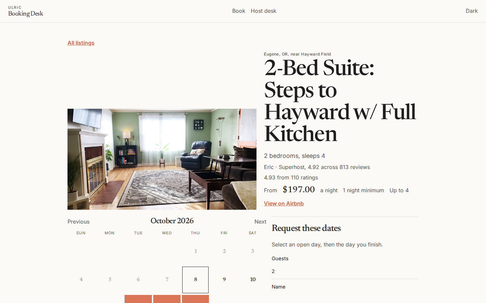 | 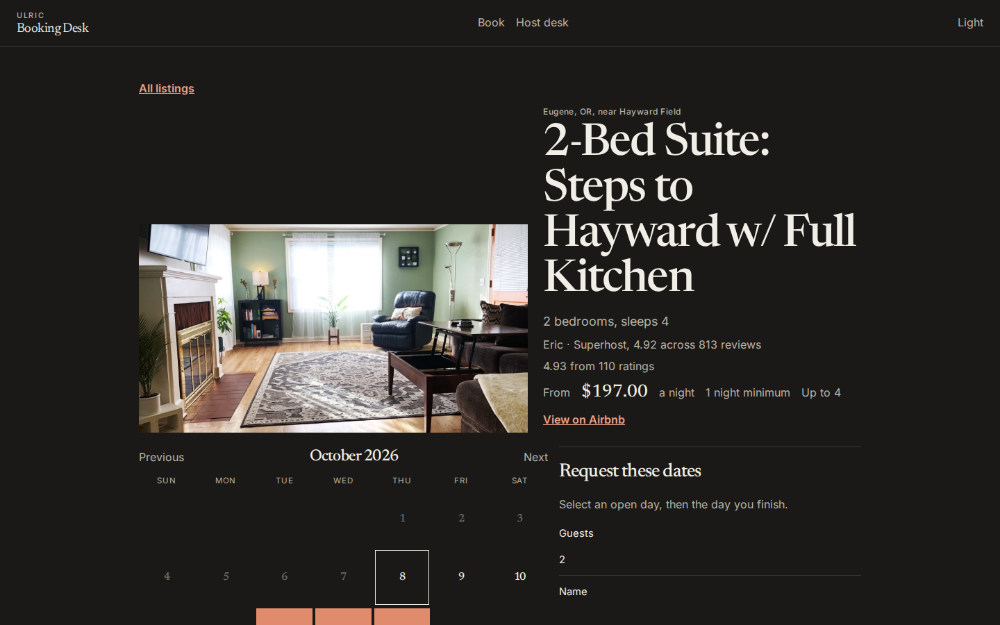 |
| 3-bed | 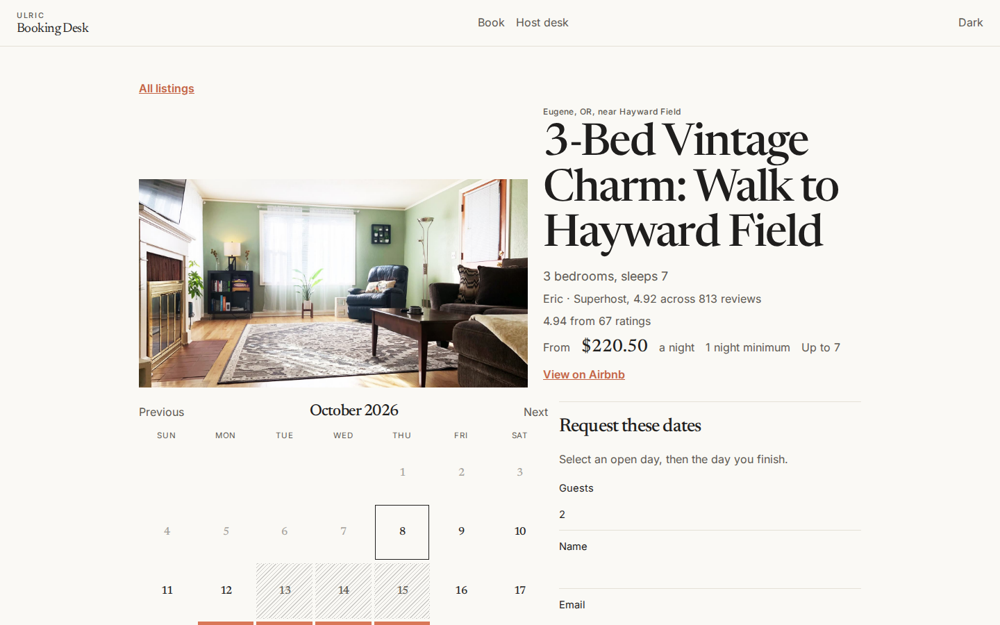 | 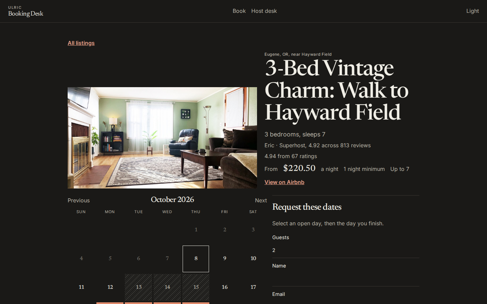 |
| 4-bed | 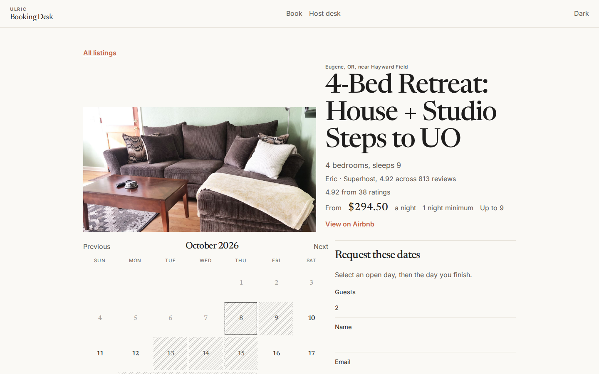 | 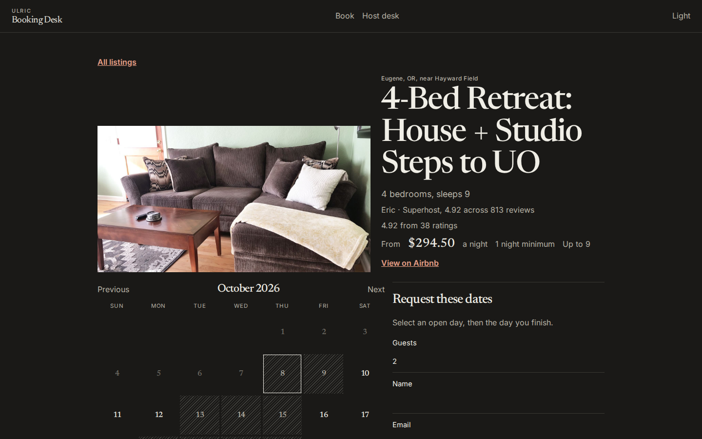 |
| Cottage | 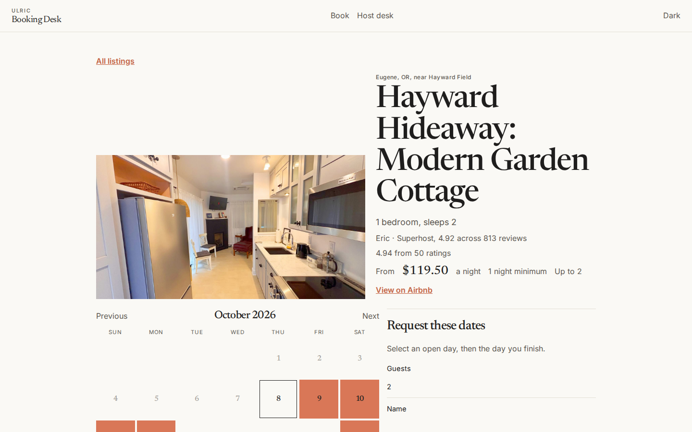 | 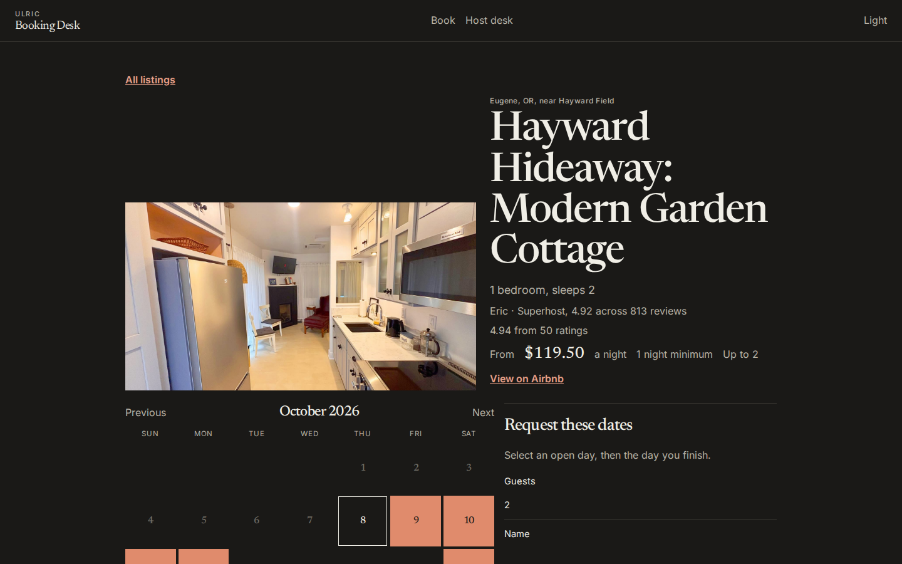 |
| Host desk | 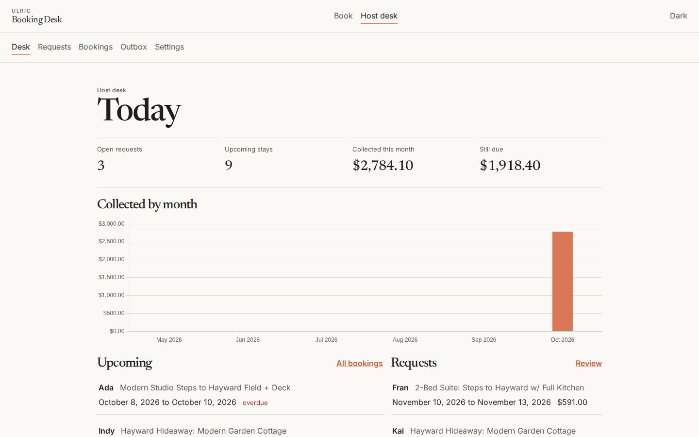 | 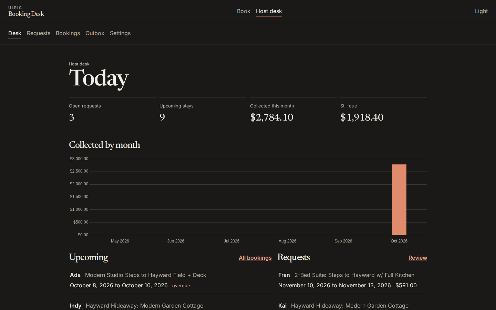 |
| Guest invoice | 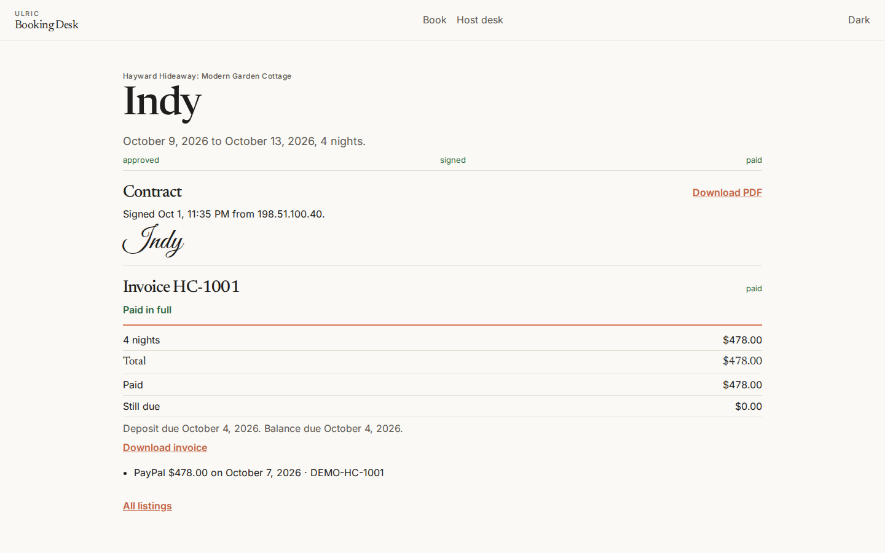 | 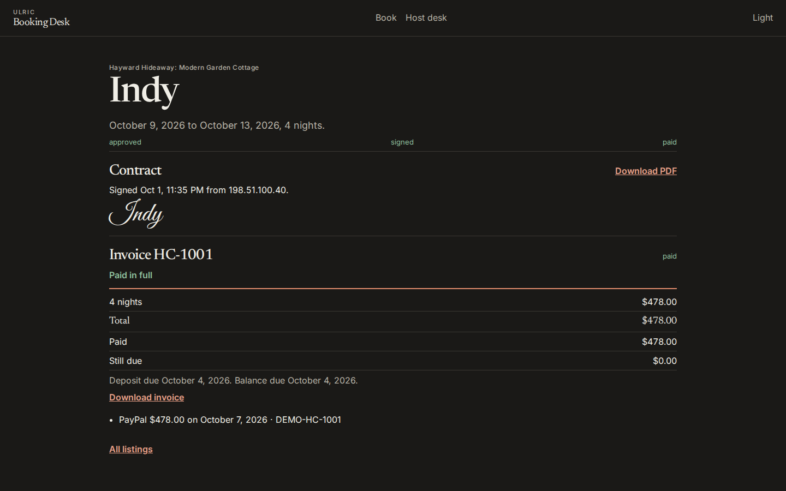 |

Phone shots for the catalog, each booking page, requests, bookings, a booking, the guest page, the outbox, and settings are in the same folder.

## Architecture

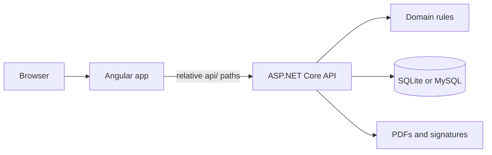

The domain project is pure logic: price quotes, date conflicts, invoice status, due dates, payment links, and the reminder schedule. The API stores listings, bookings, contracts, invoices, payments, reminders, and outbox rows. Approving a request snapshots the price, writes an unsigned agreement, opens an invoice, and schedules reminders. The default notification provider only writes a log line. The dispatcher then stores the same message on the Outbox screen.

Held days are requests. Booked days are approved stays. Declined and cancelled stays do not block the calendar. The end date does not overlap the next arrival. The 4-bed, 3-bed, 2-bed, and studio share one house, so a stay on one of them can block the others. Booking the 4-bed blocks the 3-bed, the 2-bed, and the studio. Booking the 3-bed blocks the 4-bed and the 2-bed. Booking the 2-bed blocks the 3-bed and the 4-bed. Booking the studio blocks the 4-bed only. The garden cottage links to nothing. The overlap check runs on the server and is safe on MySQL 5.7. The public calendar hatches those nights and names the unit that holds them. The page shows Eugene, OR, near Hayward Field and does not store a street address or a map pin.

## Data model

| Table | Role |
| --- | --- |
| Properties | The five Eugene stays: titles, from rates, rules, photo captions, contains graph, Airbnb URL, demo payment handles, host signature |
| Bookings | Fictional first-name guests, dates, snapshotted price, status, guest token |
| Contracts | Agreement text, signature image, signed time, IP, PDF path |
| Invoices | Number (`ST-`, `TB-`, `TH-`, `FR-`, or `HC-`), issue date |
| Payments | Method, amount, date, reference |
| Reminders | Kind, channel, schedule, pending or sent |
| Outbox | Logged reminder text. Nothing is sent |

## API

All routes are under `api/`. JSON uses string enums.

| Method | Path | Purpose |
| --- | --- | --- |
| GET | `api/health` | Liveness |
| GET | `api/properties` | The five listings |
| GET | `api/properties/{slug}` | One listing |
| PUT | `api/properties/{slug}` | Update that listing |
| GET | `api/property` | Default listing (the studio) |
| PUT | `api/property` | Update the default listing |
| GET | `api/property/signature?slug=` | Host signature PNG |
| POST | `api/property/signature?slug=` | Save the host signature name |
| GET | `api/availability?from&to&slug=` | Open, held, booked, and blocked days. Blocked days name the linked unit |
| POST | `api/quotes` | Price a date range. Optional `propertySlug` |
| POST | `api/bookings` | Create a request. Optional `propertySlug` |
| GET | `api/bookings?status=` | Host list |
| GET | `api/bookings/{id}` | Host detail |
| POST | `api/bookings/{id}/approve` | Approve, contract, invoice, reminders |
| POST | `api/bookings/{id}/decline` | Decline a request |
| POST | `api/bookings/{id}/cancel` | Cancel and skip pending reminders |
| GET | `api/bookings/{id}/contract.pdf` | Agreement PDF |
| GET | `api/bookings/{id}/invoice.pdf` | Invoice PDF |
| GET | `api/guest/{token}` | Guest page payload |
| POST | `api/guest/{token}/sign` | Typed or drawn signature |
| GET | `api/guest/{token}/contract.pdf` | Guest copy of the agreement |
| GET | `api/guest/{token}/invoice.pdf` | Guest copy of the invoice |
| POST | `api/invoices/{id}/payments` | Mark a payment |
| GET | `api/dashboard` | Counts, revenue, upcoming, requests |
| GET | `api/outbox` | Logged reminders |

## Run with Docker

```bash
docker compose up --build
```

Open http://localhost:8080. The API is also on http://localhost:5080. With no `.env` file the API uses SQLite in a Docker volume. Compose also starts MySQL 5.7 (utf8mb4) on port 3306 with the demo login `ulric` / `ulric-demo`. To use that database, set `Database__Provider=MySql` and `ConnectionStrings__MySql=Server=mysql;Port=3306;Database=ulric;User=ulric;Password=ulric-demo;CharSet=utf8mb4;SslMode=None;` in `.env`, then run compose again. Leave `Database__MySqlVersion` empty so the server version is detected.

The first start applies migrations and seeds the demo. Give it a few seconds.

## Run locally

SQLite is the zero-config default.

API:

```bash
cd api
dotnet run --project src/Ulric.BookingDesk.Api
```

The API listens on http://localhost:5080.

Web, in another terminal:

```bash
cd web
npm install
npm start
```

Open http://localhost:4200. The dev server proxies `api` to the API. The page `<base href>` is `/` in development, so relative `api/...` calls still reach the proxy.

Tests:

```bash
dotnet test api/Ulric.BookingDesk.sln
```

## Deploy under MAMP

The hosted page is http://localhost:8888/grokbot/asp/ulric-booking-desk/. Apache serves the Angular build at that sub-path and proxies `api` under the same path to Kestrel. MAMP MySQL is 5.7.39 at `127.0.0.1:8889`.

1. Create the database in MAMP MySQL:

```sql
CREATE DATABASE ulric CHARACTER SET utf8mb4 COLLATE utf8mb4_unicode_ci;
```

2. Point the API at MySQL. Example credentials belong only in `api/src/Ulric.BookingDesk.Api/appsettings.MySql.example.json` and `.env.example`. The MAMP sample login there is `root` / `root`. Do not copy that password into `appsettings.json`. Leave `Database:MySqlVersion` empty so startup calls `ServerVersion.AutoDetect`. Set it to `5.7.39-mysql` only when you want to skip detection.

```bash
export Database__Provider=MySql
export ConnectionStrings__MySql='Server=127.0.0.1;Port=8889;Database=ulric;User=root;Password=root;CharSet=utf8mb4;SslMode=None;'
export Desk__PublicBaseUrl=http://localhost:8888/grokbot/asp/ulric-booking-desk
cd api
dotnet run --project src/Ulric.BookingDesk.Api --urls http://127.0.0.1:5080
```

The first start runs the EF Core migrations and seeds both listings. `Database:Provider` defaults to `Sqlite`, so a normal `dotnet run` still works with no MySQL.

3. Build the web app with the sub-path base href and copy the browser output into the MAMP folder `grokbot/asp/ulric-booking-desk/`:

```bash
cd web
npm ci
npx ng build --base-href /grokbot/asp/ulric-booking-desk/
```

`npm run build:mamp` runs that same command. Copy `web/dist/web/browser/` into the Apache directory.

4. Proxy `api` and let Angular routes fall back to `index.html`. Enable Apache `proxy_module` and `proxy_http_module`. `docs/mamp.htaccess.example` is a starting `.htaccess` for that folder. It forwards `/grokbot/asp/ulric-booking-desk/api` to `http://127.0.0.1:5080/api`.

Relative calls (`api/...`, `photos/...`, agreement and invoice downloads) resolve against the `<base href>`, so they stay under the sub-path. Angular `routerLink` values stay inside the app. When `Desk:PublicBaseUrl` is set, the API fills `guestUrl` and appends that URL to reminder text. The host copy button uses `guestUrl` when it is present, and otherwise builds the link from `document.baseURI`.

Migrations were applied on MySQL 5.7.44 (the current 5.7 image; MAMP is 5.7.39). Tables use `utf8mb4_unicode_ci`. Indexed strings are short enough for the 5.7 index limit. The migration does not use MySQL 8-only SQL.

## Environment

Copy `.env.example` for local overrides. Checked-in `appsettings.json` keeps SQLite and an empty MySQL connection string. There are no secrets in this repo.

| Variable | Purpose |
| --- | --- |
| `ASPNETCORE_ENVIRONMENT` | `Development` or `Production` |
| `ASPNETCORE_URLS` | Bind address, for example `http://127.0.0.1:5080` |
| `Database__Provider` | `Sqlite` (default) or `MySql` |
| `Database__MySqlVersion` | Empty or `AutoDetect` to detect the server. Or a pin such as `5.7.39-mysql` |
| `ConnectionStrings__Default` | SQLite file, for example `Data Source=data/ulric.db` |
| `ConnectionStrings__MySql` | MySQL connection string. Required only when the provider is `MySql` |
| `Storage__Root` | Folder for signature images and PDFs |
| `Desk__RemindersEnabled` | `true` to run the reminder background service |
| `Desk__ReminderIntervalSeconds` | How often due reminders are logged. Minimum 5 |
| `Desk__TimeZone` | IANA zone for "today". Default `America/Los_Angeles` |
| `Desk__PublicBaseUrl` | Public origin and sub-path, with no trailing slash required. Example `http://localhost:8888/grokbot/asp/ulric-booking-desk` |
| `MYSQL_DATABASE`, `MYSQL_USER`, `MYSQL_PASSWORD`, `MYSQL_ROOT_PASSWORD` | Compose only. Demo defaults are database `ulric` and password `ulric-demo` |

## Tests

```bash
dotnet test api/Ulric.BookingDesk.sln
```

xUnit covers pricing, availability conflicts, the house link graph, invoice status, reminder scheduling, payment links, public URL joining, and an API flow: seed, quote, conflict, approve, sign, PDF, partial payment, paid. Another flow checks that a studio request blocks the 4-bed, a 2-bed request blocks the 3-bed, the studio can still be booked beside the 2-bed, and the cottage can be booked on the studio's dates.

GitHub Actions runs `dotnet test` and `npm run build` on pull requests.

## Credits

Photographs are Eric's own listing photos, resized to 1600px, in `web/public/photos/{airbnbId}/`. [CREDITS.md](CREDITS.md) records that credit. Demo bookings use fictional first names. No guest review text is stored.
