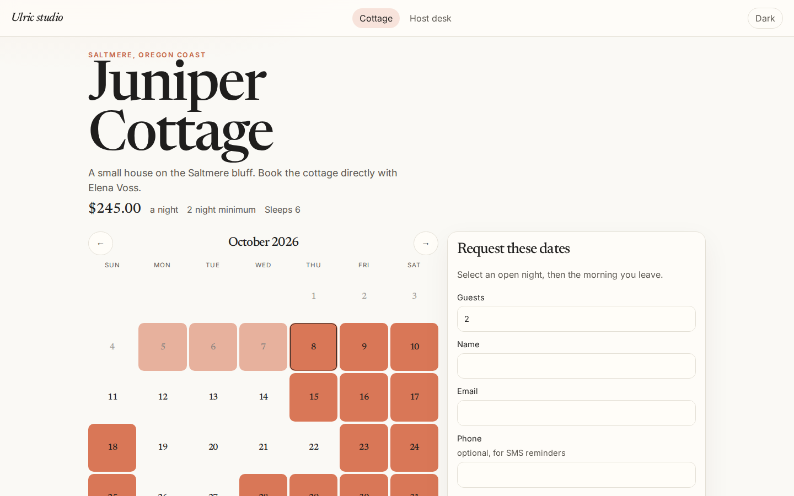

# Ulric Booking Desk



Direct booking and invoicing for a small host. Guests request dates on a public page. The host approves the stay, collects a signed contract, tracks the invoice, and keeps reminders in an outbox.

The demo property is Juniper Cottage, a fictional coastal rental run by Elena Voss.

## Features

- Public booking page with a month calendar. Open, held, and booked nights are marked. A request form quotes the stay before it is sent.
- Host desk with open requests, upcoming stays, a monthly revenue chart, and settings for the nightly rate, deposit percent, cleaning fee, service fee, house rules, and cancellation policy.
- A contract PDF for each approved stay. The guest signs in the browser with a typed script signature or a drawn signature. The signed file stores the signature image, the time, and the IP address. The host signature is set in advance. Both sides can download the PDF.
- An invoice per approved stay with line items, deposit, balance, and due dates. PayPal and Venmo links use the demo handle `ulric-demo`, and each link has a QR code. The host can mark a payment with method, amount, date, and reference. Status chips show unpaid, partial, paid, and overdue.
- A reminder schedule for the deposit, the balance, check-in instructions, and a review request. Email is always scheduled. SMS is scheduled when the guest left a phone number. A background service logs due reminders to the Outbox. Nothing is emailed or texted.

## Stack

- ASP.NET Core 8 Web API
- Angular (standalone components and signals)
- SQLite with Entity Framework Core
- QuestPDF community license for contracts
- Chart.js for the revenue chart
- Leaflet with OpenStreetMap tiles for the cottage pin
- xUnit for pricing, availability, invoice status, and reminder scheduling

## Run with Docker

```bash
docker compose up --build
```

Open http://localhost:8080. The API is also published on http://localhost:5080. The first start writes the demo database and contract files into a Docker volume, so give it a few seconds.

## Run locally

API:

```bash
cd api
dotnet run --project src/Ulric.BookingDesk.Api
```

The API listens on http://localhost:5080.

Web, in another terminal:

```bash
cd web
npm install
npm start
```

Open http://localhost:4200. The dev server proxies `/api` to the API.

Tests:

```bash
dotnet test api/Ulric.BookingDesk.sln
```

## Environment

Copy `.env.example` if you want local overrides. The checked-in `api/src/Ulric.BookingDesk.Api/appsettings.json` and `appsettings.Development.json` contain the same demo values. `appsettings.Development.example.json` is the template. There are no secrets in this repo. Payment handles in the demo are `ulric-demo`.

| Variable | Purpose |
| --- | --- |
| `ASPNETCORE_ENVIRONMENT` | `Development` or `Production` |
| `ASPNETCORE_URLS` | Bind address for the API, for example `http://+:8080` |
| `ConnectionStrings__Default` | SQLite connection string, for example `Data Source=data/ulric.db` |
| `Storage__Root` | Folder for signature images and contract PDFs |
| `Desk__RemindersEnabled` | `true` to run the reminder background service |
| `Desk__ReminderIntervalSeconds` | How often due reminders are logged. Minimum 5 |
| `Desk__TimeZone` | IANA time zone used for "today", default `America/Los_Angeles` |

## Architecture

The domain project holds the rules that do not need a database: price quotes, date conflicts, invoice status, due dates, payment links, and the reminder schedule. The API project stores one property, bookings, contracts, invoices, payments, reminders, and outbox rows in SQLite. Approving a request snapshots the price, writes an unsigned contract PDF, opens an invoice, and schedules reminders. The default notification provider only writes a log line. The dispatcher then stores the same message on the Outbox screen.

Held nights are requests. Booked nights are approved stays. Declined and cancelled stays do not block the calendar. Checkout morning does not overlap the next arrival.

## Screenshots

Light and dark captures of the main screens, at desktop (1440x900) and phone (390x844), are in `docs/screenshots/`.
